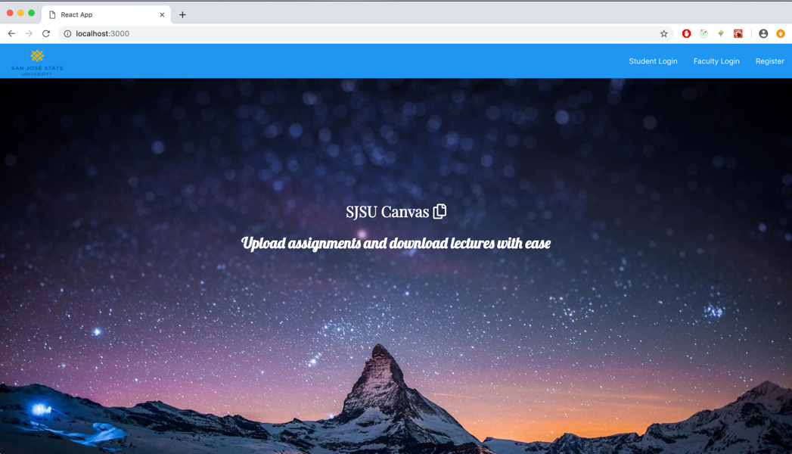
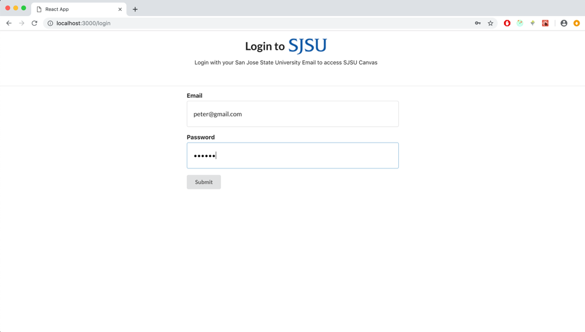
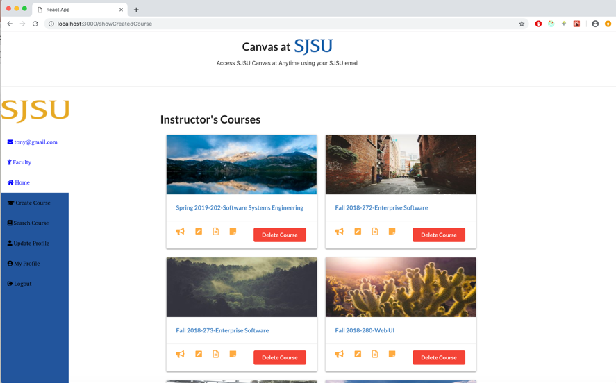
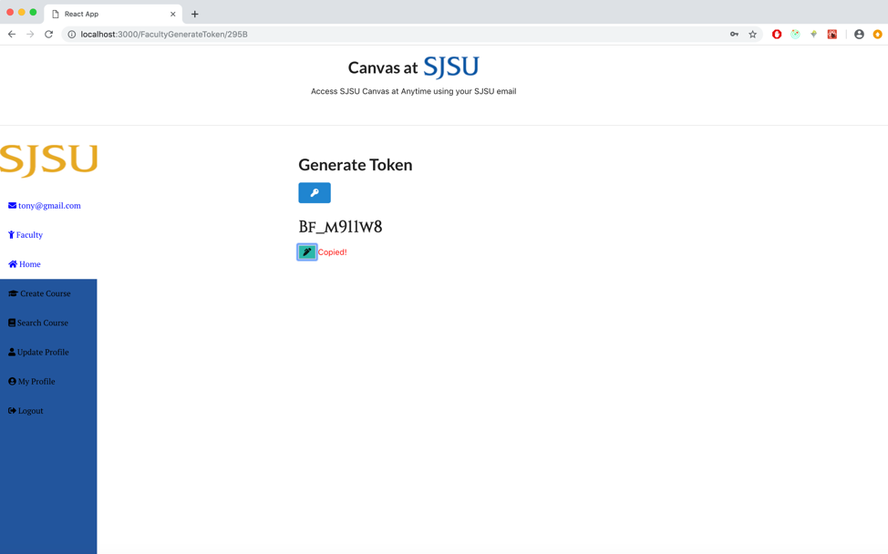
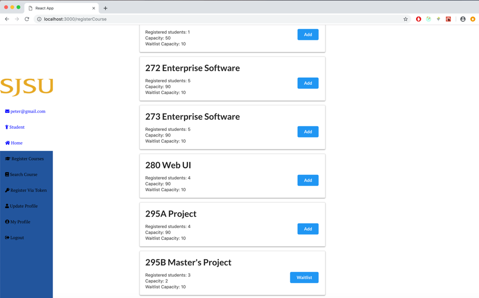
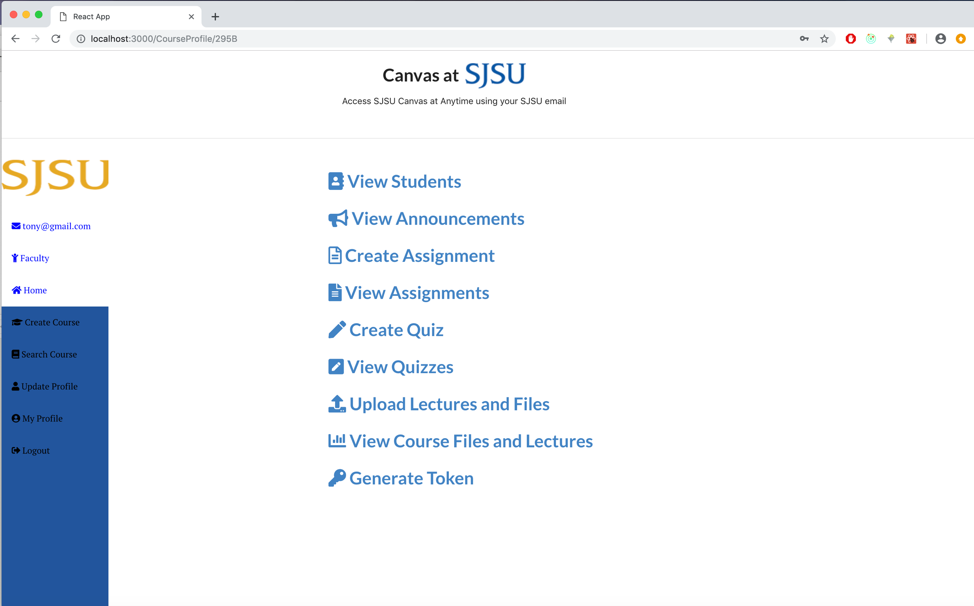
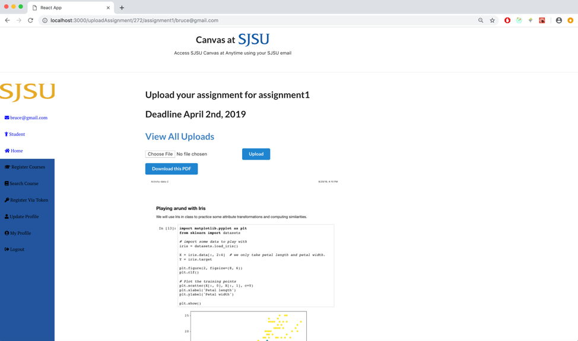

# Canvas Clone
### Running instruction

1. Start the MySQL server
2. Clone the folder
3. cd into Calculator/frontend folder
4. Execute ```npm install```
5. cd into Calculator/backend folder
6. Execute ```npm install```
7. Finally, ```npm start``` or ```npm run dev``` (This will start both the Nodejs server and the react app)
8. Create a database named "Canvas273". Enter ```localhost:5000/createUserDB``` in the browser.  (GET request)
9. There are a number of tables you will have to create in the "Canvas273" database
10. You just have to hit the endpoints (GET requests) below to create them.
Type in the urls in the browser.

| GET Requests for Creating Tables  |
|----------------------------------------------------|
| localhost:5000/createUserTable |
| localhost:5000/createProfile |
| localhost:5000/createCourseListTable |
| localhost:5000/createCourseTable |
| localhost:5000/createAnnouncementTable |
| localhost:5000/createAssignmentsTable |
| localhost:5000/createUploadsTable |
| localhost:5000/createQuiz |
| localhost:5000/createGradeBook |
| localhost:5000/createTableFile |
| localhost:5000/createCourseAddTokenTable |


### Landing Page


### Login Page


### Instructor's Dashboard


### Register Courses via a token



### Register Courses



### Instructor Functionalities



### Upload PDFs


