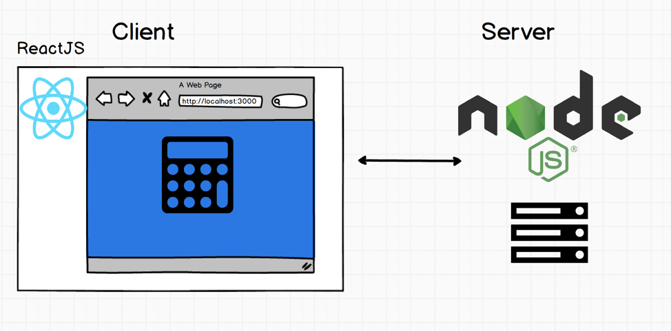
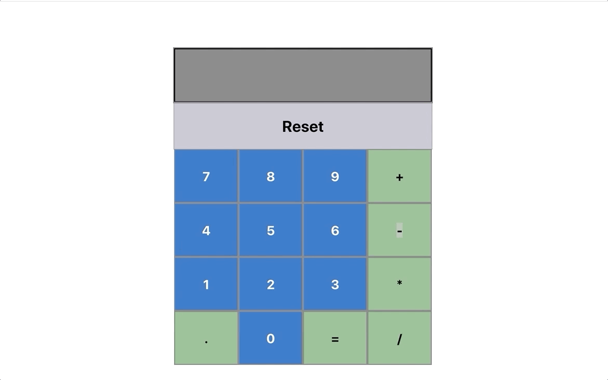

# Calculator App
### Running instruction

1. Clone the folder
2. cd into Calculator/frontend folder
3. Execute ```npm install```
4. cd into Calculator/backend folder
5. Execute ```npm install```
6. Finally, ```npm start``` or ```npm run dev``` (This will start both the Nodejs server and the react app)

Make sure no other ports are using localhost:3000 or localhost:5000

### Client && Server Architecture


### Demo

