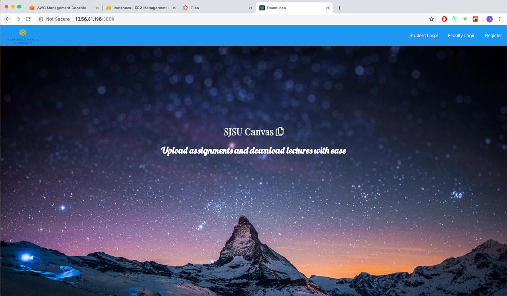
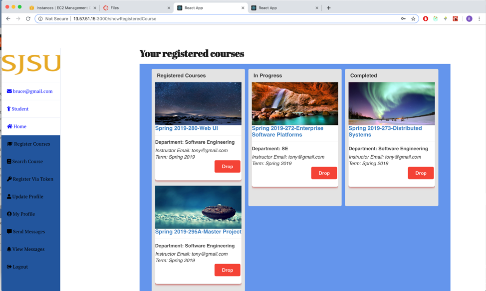
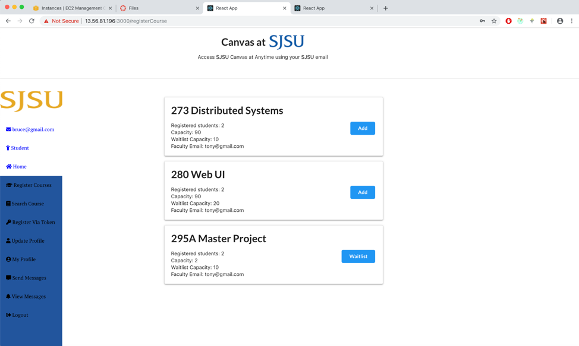
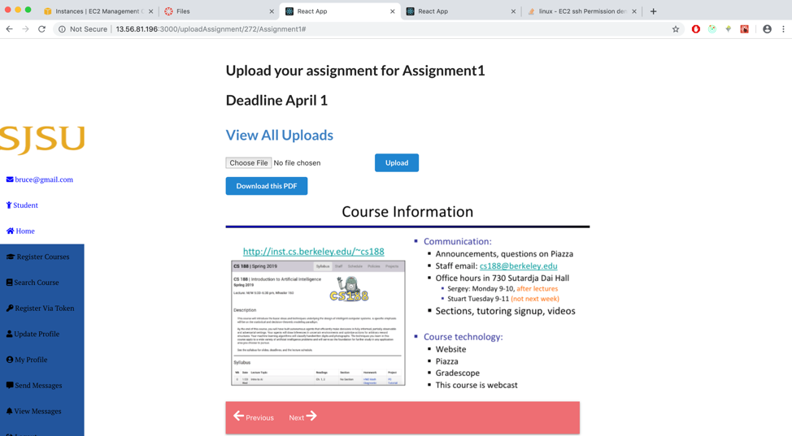
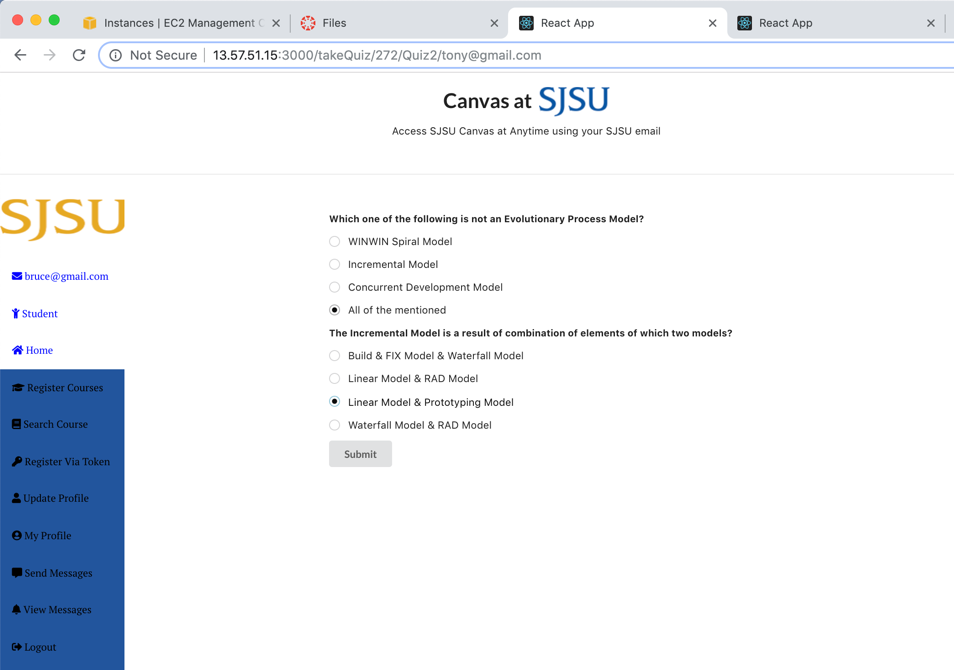
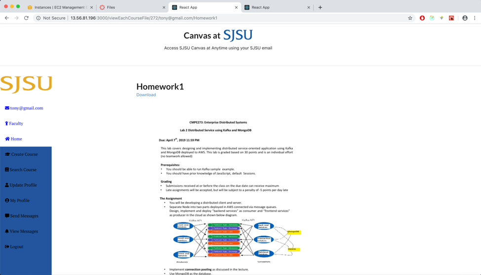
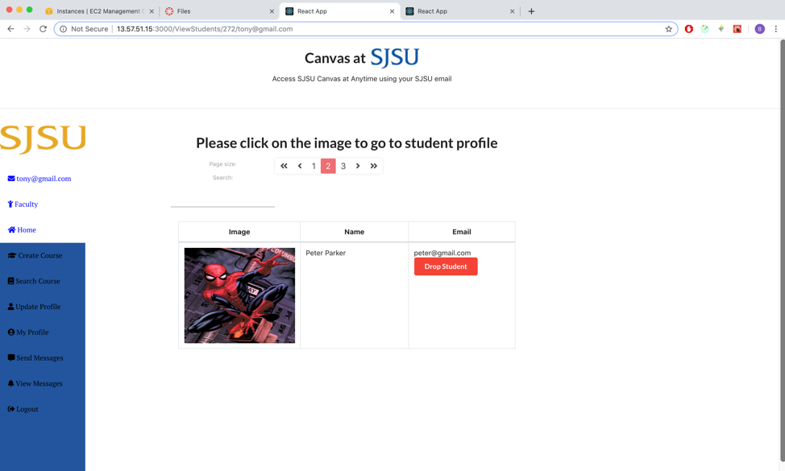

# Canvas Clone
### Running instruction

1. cd into kafka-backend. Type ```npm install```
2. Open another terminal. cd into frontend.  Type ```npm install```
3. Open another terminal. cd into backend.  Type ```npm install```
4. Make sure Kafka and Zookeeper are running.
5. In kakfa-backend, type ```npm run server```
5. In backend, type ```npm run dev```. This will start both frontend and backend.


### Landing Page


### Dashboard


### Register


### Assignment


### Quiz


### Homework


### Profile


