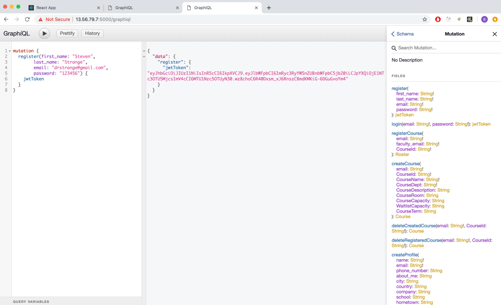
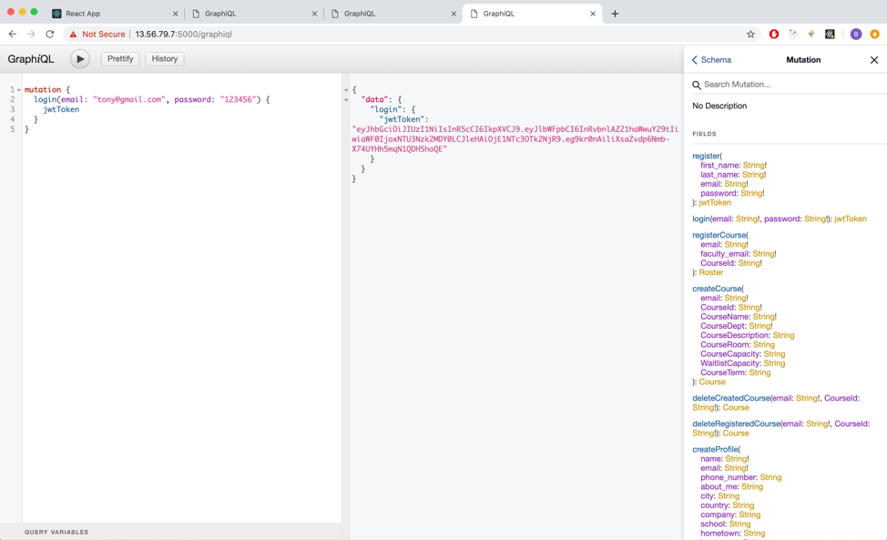
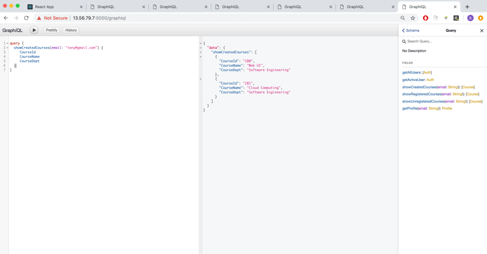
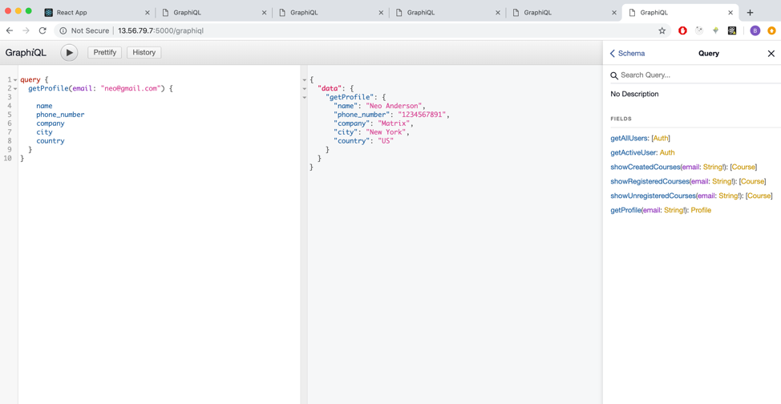
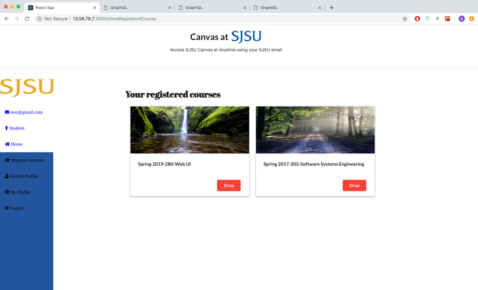
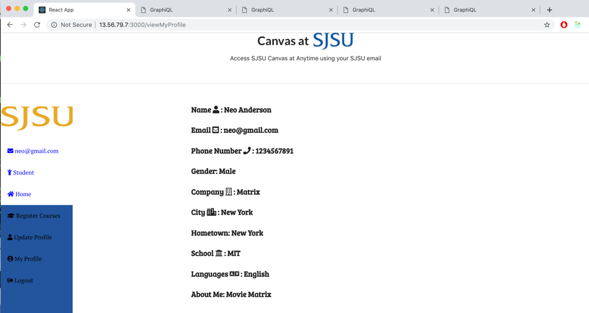

# Lab 3 GraphQL and React Apollo 
### Running instruction

1. Install concurrently globally. Type ```npm install -g concurrently```
2. cd into backend. Type ```npm install```
3. After that, type ```npm run dev```. This will start both frontend and backend


### GraphiQL (Register)


### GraphiQL (Login)


### GraphiQL (Registered Courses)



### GraphiQL (Get Profile Info)


## UI





